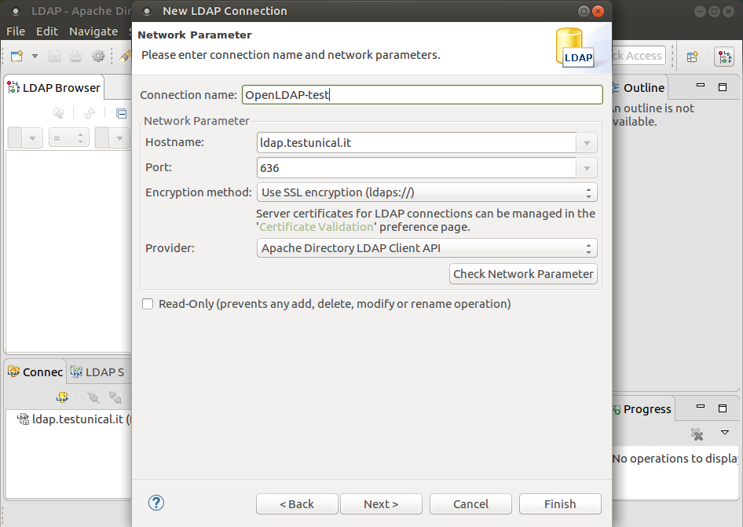
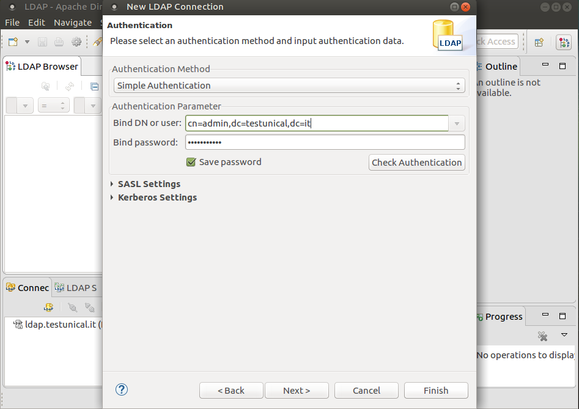
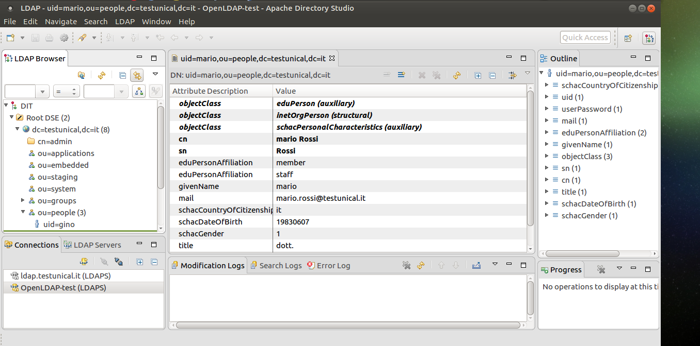
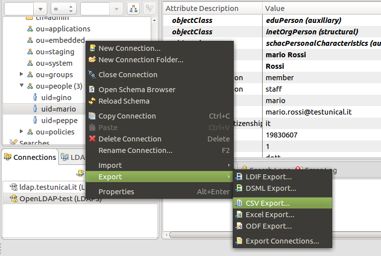

Ansible slapd
-------------
This playbook will install a slapd server with:

 - MDB backend
 - eduperson2016 schema
 - schac-2015 schema
 - memberOf overlay
 - ppolicy overlay
 - pw-sha2 overlay for SSHA-512, SSHA-384, SSHA-256, SHA-512, SHA-384 and SHA-256 passwords
 - Monitor backend
 - Unique overlay (default field: mail)
 - SSL only (ldaps://)
 - Unit test for ACL and Password Policy overlay (work in progress)

You can also import users from a CSV file, globals parameters can also be edited in playbook.yml.
This behaviour can be suppressed changing this variable in the playbook:
````
import_example_users: true
````

All about overlays configuration can be found in:
````
roles/slapd_configuration/templates/*
````

Tested on
---------
- Debian 9

Requirements
------------
````
apt install python3-dev python3-setuptools python3-pip easy-rsa
pip3 install ansible
````

Setup Certificates
------------------

In order to use SASL/TLS  you must have certificates, for testing purposes 
a self-signed certificate will suffice. To learn more about certificates, see OpenSSL.
Remeber that OpenLDAP cannot use a certificate that has a password associated to it.

First of all create your certificates and put them in roles/files/certs/ then 
configure the FQDN associated to it in playbook variables. A script named make_CA.sh can do this automatically, 
it will create your own self signed keys with easy-rsa. 

Play this book
--------------
Running it locally
````
ansible-playbook -i "localhost," -c local playbook.yml [-vvv]

# trick for a pretty print
ansible-playbook -i "localhost," -c local playbook.yml | sed 's/\\n/\n/g'
````

Play with LDAP administrative's tasks
-------------------------------------
Commands related to OpenLDAP that begin with ldap (like ldapsearch) are 
client-side utilities, while commands that begin with slap (like slapcat) are server-side.

````
# root DSE
ldapsearch -H ldap:// -x -s base -b "" -LLL "+"

# DITs
ldapsearch -H ldap:// -x -s base -b "" -LLL "namingContexts"

# config DIT
ldapsearch -H ldap:// -x -s base -b "" -LLL "configContext"

# read config
ldapsearch -H ldapi:// -Y EXTERNAL -b "cn=config" -LLL

# small config output
ldapsearch -H ldapi:// -Y EXTERNAL -b "cn=config" -LLL -Q dn

# read top level entries
ldapsearch -H ldapi:// -Y EXTERNAL -b "cn=config" -LLL -Q -s base

# find admin entry
ldapsearch -H ldapi:// -Y EXTERNAL -b "cn=config" "(olcRootDN=*)" olcSuffix olcRootDN olcRootPW -LLL -Q

# read builtin schemas
ldapsearch -H ldapi:// -Y EXTERNAL -b "cn=schema,cn=config" -s base -LLL -Q | less

# read additional schemas
# ldapsearch -H ldapi:// -Y EXTERNAL -b "cn=schema,cn=config" -LLL -Q
ldapsearch -H ldapi:// -Y EXTERNAL -b "cn=schema,cn=config" -LLL -Q dn

# get the content of an entry
ldapsearch -H ldapi:// -Y EXTERNAL -b "cn={3}inetorgperson,cn=schema,cn=config" -s base -LLL -Q

# loaded modules
ldapsearch -H ldapi:// -Y EXTERNAL -b "cn=config" -LLL -Q "objectClass=olcModuleList"

# Check Password Policy schema on openLDAP
ldapsearch -QLLLY EXTERNAL -H ldapi:/// -b cn=schema,cn=config cn=*ppolicy dn

# available backends
ldapsearch -H ldapi:// -Y EXTERNAL -b "cn=config" -LLL -Q "objectClass=olcBackendConfig"

# databases configured in
ldapsearch -H ldapi:// -Y EXTERNAL -b "cn=config" -LLL -Q "olcDatabase=*" dn

# view configuration of a database, {number} may vary
ldapsearch -H ldapi:// -Y EXTERNAL -b "olcDatabase={1}mdb,cn=config" -LLL -Q -s base

# view SASL supporthem mechanisms
ldapsearch -x -H ldapi:/// -b "" -LLL -s base supportedSASLMechanisms
````

Access Control lists debug
--------------------------
````
# test ACL
slapacl -F /etc/ldap/slapd.d/  -b "dc=testunical,dc=it" -D "cn=admin,dc=testunical,dc=it"

# test if a normal user could read data of other users
slapacl -F /etc/ldap/slapd.d/  -b "uid=gino,ou=people,dc=testunical,dc=it" -D "uid=mario,ou=people,dc=testunical,dc=it" -d acl 'cn/read'

# test special idp-user in ou=applications with more advanced query
slapacl -F /etc/ldap/slapd.d/ -b "uid=gino,ou=people,dc=testunical,dc=it" -D "uid=idp,ou=applications,dc=testunical,dc=it" -d acl 'cn/read'

# test single field read/write
slapacl -F /etc/ldap/slapd.d/  -b "uid=gino,ou=people,dc=testunical,dc=it" -D "uid=gino,ou=people,dc=testunical,dc=it" -d acl 'cn/write'
slapacl -F /etc/ldap/slapd.d/  -b "uid=gino,ou=people,dc=testunical,dc=it" -D "uid=gino,ou=people,dc=testunical,dc=it" -d acl 'userPassord/write'
slapacl -F /etc/ldap/slapd.d/  -b "uid=gino,ou=people,dc=testunical,dc=it" -D "uid=gino,ou=people,dc=testunical,dc=it" -d acl 'mail/write'

````

Play with content data
----------------------
````
# query entry set
ldapsearch -H ldapi:// -Y EXTERNAL -b "dc=testunical,dc=it" -LLL

# query entry set with operational metadata
ldapsearch -H ldapi:// -Y EXTERNAL -b "dc=testunical,dc=it" -LLL "+"

# The subschema is a representation of the available classes and attributes.
ldapsearch -H ldapi:// -Y EXTERNAL -b "dc=testunical,dc=it" -LLL subschemaSubentry

# change a normal ldap user password with admin privileges
ldappasswd -H ldaps://ldap.testunical.it -D 'cn=admin,dc=testunical,dc=it' -w slapdsecret  -S -x "uid=gino,ou=people,dc=testunical,dc=it"

# change entries in a interactive way (using a console text editor as vi or nano)
ldapvi -D "cn=admin,dc=testunical,dc=it" -w slapdsecret -b 'uid=gino,ou=people,dc=testunical,dc=it'

````

Remote connections
------------------
````
# bind to ldaps:// on local
ldapsearch -H ldaps:/// -b "dc=testunical,dc=it" -LLL -D "cn=admin,dc=testunical,dc=it" -w slapdsecret

# remote client authentication test (ldap_ca_cert must be copied to clients, hostname must be resolvend at least in /etc/hosts by them)
ldapsearch -H ldaps://ldap.testunical.it:636 -b "dc=testunical,dc=it" -LLL -D "cn=admin,dc=testunical,dc=it" -w slapdsecret -d 1

# test remote client connection
ldapwhoami -x -H ldaps://ldap.testunical.it -D "uid=gino,ou=people,dc=testunical,dc=it" -w geu45 -d 1

# ldap user change his password by himself
ldappasswd -H ldaps://ldap.testunical.it -D 'uid=gino,ou=people,dc=testunical,dc=it' -w ginopassword  -S -x "uid=gino,ou=people,dc=testunical,dc=it"
````

Shibboleth IDP integration
--------------------------
A special OU called "applications" makes every entry in it to read all attributes of ou=people entries.

PPolicy management
------------------
````
# get all locket out accounts
ldapsearch -H ldaps://ldap.testunical.it -D "cn=admin,dc=testunical,dc=it" -b "ou=people,dc=testunical,dc=it"  -w slapdsecret "pwdAccountLockedTime=*" pwdAccountLockedTime

# unlock ldif
dn: cn=gino,ou=people,dc=testunical,dc=it
changetype: modify
delete: pwdAccountLockedTime

# unlock with ldapvi
ldapvi -D 'cn=admin,dc=testunical,dc=it' -w slapdsecret -b 'uid=mario,ou=people,dc=testunical,dc=it' "pwdAccountLockedTime=*" pwdAccountLockedTime

# or pwdReset. It must be then resetted using ldappasswd
dn: cn=gino,ou=people,dc=testunical,dc=it
changetype: modify
add: pwdReset
pwdReset: TRUE

# force a pwdReset with ldapvi
ldapvi -D 'cn=admin,dc=testunical,dc=it' -w slapdsecret -b 'uid=mario,ou=people,dc=testunical,dc=it' "pwdReset=*" pwdReset

# a user that resets a password by his own
ldappasswd -D 'uid=mario,ou=people,dc=testunical,dc=it' -a cimpa12 -w cimpa12

````

Backup and restore
------------------
It will extract the entire database contents into the "backup_slapd.ldif" file 
and then restore "backup_slapd.ldif", importing it back into the LDAP after 
a system rebuild.
````
# entire backup
slapcat -vl backup_slapd.ldif

# restore (you should have to destroy /var/lib/ldap first if you experience DIT collisions)
slapadd -vl backup_slapd.ldif

# backup config (you should have to destroy /etc/ldap/slapd.d first if you experience DIT collisions)
slapcat -F /etc/ldap/slapd.d -n 0 -l "$(hostname)-ldap-mdb-config-$(date '+%F').ldif"
````

Schemas and Overlays
--------------------

MemberOf overlay

MemberOf overlay made a client to be able to determine which groups an entry 
is a member of, without performing an additional search. Examples of this 
are applications using the DIT for access control based on group authorization.

The memberof overlay updates an attribute (by default memberOf) whenever 
changes occur to the membership attribute (by default member) of entries of 
the objectclass (by default groupOfNames) configured to trigger updates.

Thus, it provides maintenance of the list of groups an entry is a 
member of, when usual maintenance of groups is done by modifying the 
members on the group entry.


Hints
-----
- ldap:// is disabled (it will works only in local), only ldapi:/// and ldaps:/// will be available;
- Be aware that ldapmodify is sensitive to (trailing) spaces;
- https://www.openldap.org/doc/admin24/appendix-common-errors.html
- https://www.switch.ch/aai/guides/idp/installation/
- Error 80 (implementation specific error) raises when tls certs doesn't have read permissions or if the ldif used with ldapadd/ldapmodify have some trailing spaces or too many blank lines or some syntax error;
- ldapadd, ldapsearch, ldapmodify: set debug level with -d 1 or more. It's the only way to get ldap be more eloquent;
- every client must have slapd-cacert.pem configured in /etc/ldap.conf (pem file could be copied with scp);
- Passwords in the CSV example file will be stored by LDAP in cleartex format, don't do this in production environment, {SSHA} is a good choice. You can find a good SSHA generator here: https://github.com/peppelinux/pySSHA-slapd
- SCHACH objectClasses are well listed here: https://wiki.refeds.org/display/STAN/SCHAC+OID+Registry

Create fake users using CSV file
--------------------------------
It would be also possible to create your own custom fake users using a CSV file


You can create and Map oid to one or more csv columns in the csv2ldif.py file.
Csv2ldif.py works this way: if a value contains ('name', 'surname') in ATTRIBUTES_MAP the corrisponding csv columns
will be merged into one oid value, named with the relative ATTRIBUTES_MAP key. 
If csv column value is composed by many values separated by commas instead,
it will create many ldif rows how the splitted csv values are.
````
# csv2ldif.py
ATTRIBUTES_MAP=OrderedDict([('dn', 'dn'),
                            ('objectClass', 'objectClass'),
                            ('uid','dn'),
                            ('sn', 'surname'),
                            ('givenName', 'name'),
                            ('cn', ('name', 'surname')),
                            ('mail', 'mail'),
                            ('userPassword', 'password'),
                            ('edupersonAffiliation', 'groups')])
````

Edit the users in the csv file and then export them in ldif format using csv2ldif:
````
cd roles/slapd/templates/entries/
# edit csv file
nano entries-people.csv
python csv2ldif.py entries-people.csv > entries-people.ldif
python csv2ldif.py entries-people.csv
````

It simply print the exported ldif format in stdout:
````
dn: uid=mario,dc=testunical,dc=it
objectClass: inetOrgPerson
objectClass: eduPerson
uid: mario
sn: Rossi
givenName: mario
cn: mario Rossi
mail: mario.rossi@testunical.it
userPassword: cimpa12
edupersonAffiliation: staff
edupersonAffiliation: member

dn: uid=peppe,dc=testunical,dc=it
objectClass: inetOrgPerson
objectClass: eduPerson
uid: peppe
sn: Grossi
givenName: peppe
cn: peppe Grossi
mail: pgrossi@testunical.it
mail: pgrossi@edu.testunical.it
userPassword: roll983
edupersonAffiliation: faculty

[...]
````
This is not mandatory, probably you'll prefer to use a standard ldif format!

Awesome utilities
-----------------
Tools to test and use before you die.

- ldapvi makes a query and let us modify its content, and save this in LDAP, using our favorite system text editor (as vi or nano!) : 
  - http://www.lichteblau.com/ldapvi/manual/


- ldapsh let us navigate the LDAP tree like a filesystem tree, awesome!
  - http://ldapsh.sourceforge.net/
  - https://github.com/maufl/ldapsh

- ApacheActiveDirectory is a very good LDAP general purpose navigator. It will not came with support for ppolicy fields and specific slapd's ACL editor and Monitor backend but it will be good for everything else. You can download it from its official site: http://directory.apache.org/studio/downloads.html







License
-------
BSD

Author Information
------------------
Giuseppe De Marco <giuseppe.demarco@unical.it>
